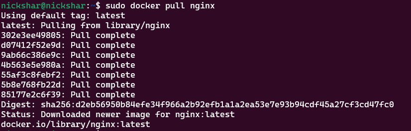
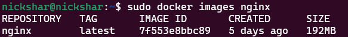
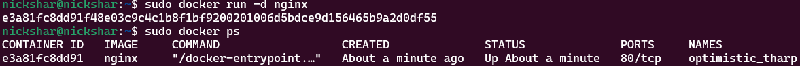
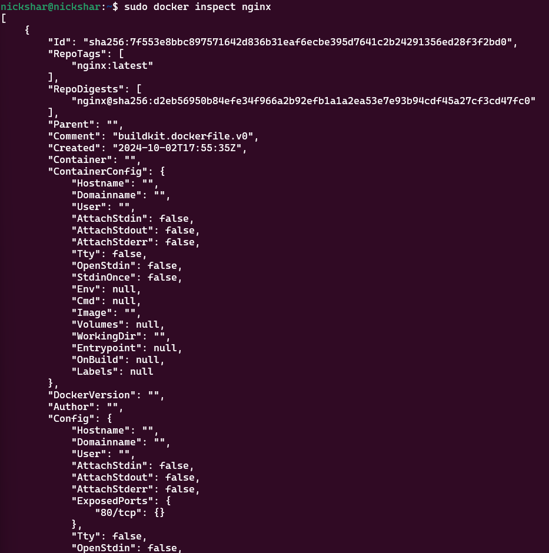
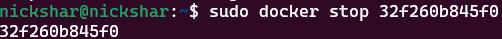
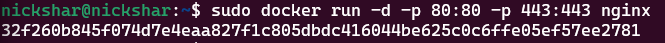
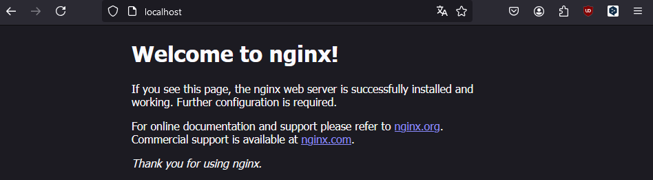
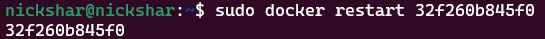

## SimpleDocker/Part_1

- Ввод команды `sudo docker pull nginx`: скачивание образа контейнера

- Ввод комнады `sudo docker images nginx`: проверка с какким параметрами сохранён образ

- Ввод команды `sudo docker run -d nginx` и `sudo docker ps`: запуск и проверка образа

- Ввод команды `sudo docker inspect nginx`: проверка внутренних параметров образа

- Ввод команды `sudo docker stop 32f260b845f0`: Остановка работы контейнера (другой id контейнера тк я прошлую остановку забыл зафиксировать скрином)

- Ввод команды `sudo docker run -d -p 80:80 -p 443:443 -d nginx`: запуск с параметрами для localhost

- Открытие в браузезере `localhost:80`

- Ввод команды `sudo docker restart 32f260b845f0`

****