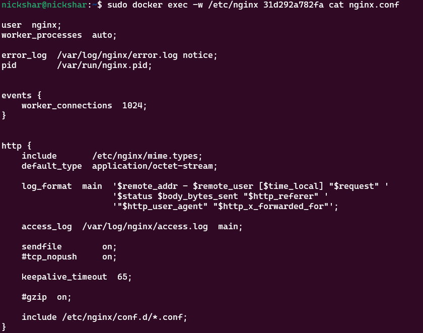
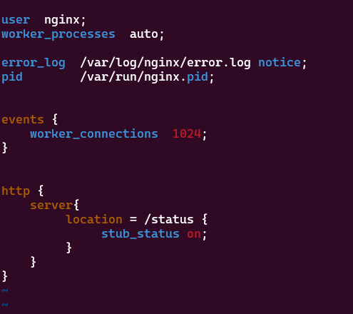
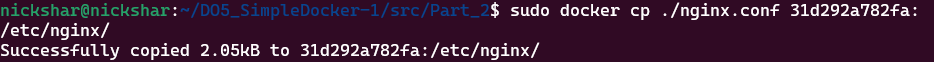
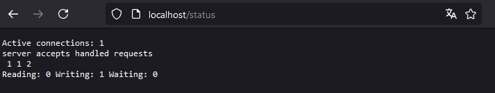
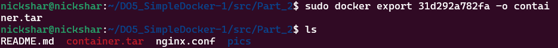
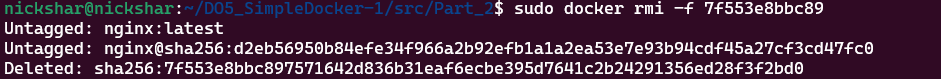
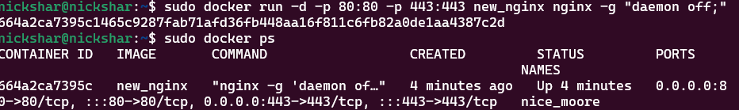
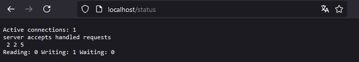

## SimpleDocker/Part_2
- **Ввод команды:** `sudo docker exec -w /etc/nginx 31d292a782fa cat nginx.conf`**:** просмотр конфигурационного файла образа nginx

- **Ввод команды:** `touch nginx.config` и `sudo vim nginx.conf`**:**

- **Отредактированный** новый конфигурационный файла

- **Ввод команды** `sudo docker cp ./nginx.conf 31d292a782fa:/etc/nginx/`**:** копирование нового конфигурационного файла в папку образа nginx

- **Ввод команды:** `sudo docker restart 31d292a782fa`**:** перезапуск контейнера

- **Проверка вывода:** `localhost/status`

- **Ввод команды:** `sudo docker export 31d292a782fa -o container.tar`**:** экспортирование контейнера

- **Ввод команды:** `sudo docker stop 31d292a782fa`**:** остановка работы активного контейнера

- **Ввод команды:** `sudo docker rmi -f 7f553e8bbc89`**:** форс удаление образа контейнера nginx по его id

- **Ввод команды:** `sudo docker import container.tar new_nginx`**:** импорт в новый образ под название new_nginx
- (Забыл сохранить скрин, дальше по скринам будет видно что всё работает)
- **Ввод команды:** `sudo docker run -d -p 80:80 -p 443:443 -d new_nginx -g nginx "daemon off;"`**:** запуск импортированного образа

- **Проверка вывода:** `localhost/status`

****